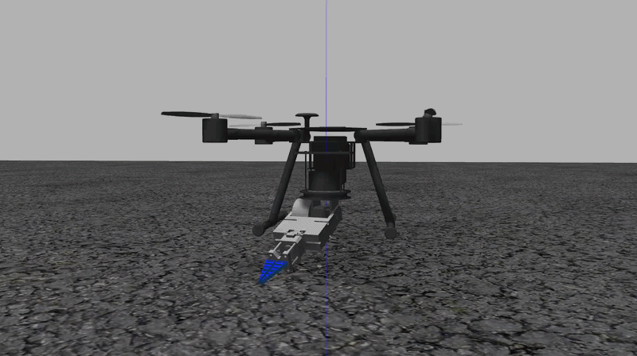
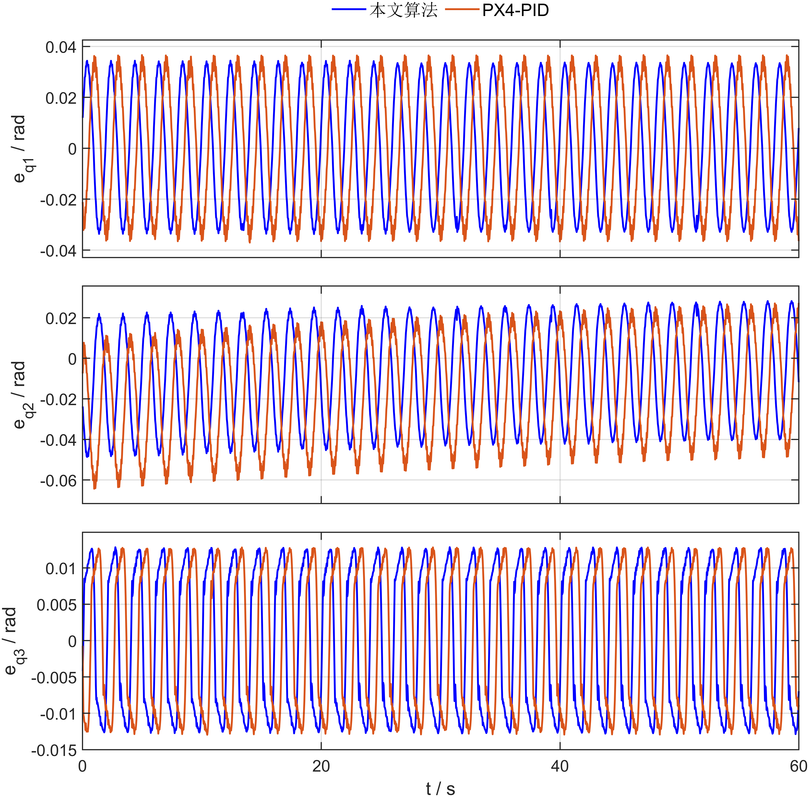
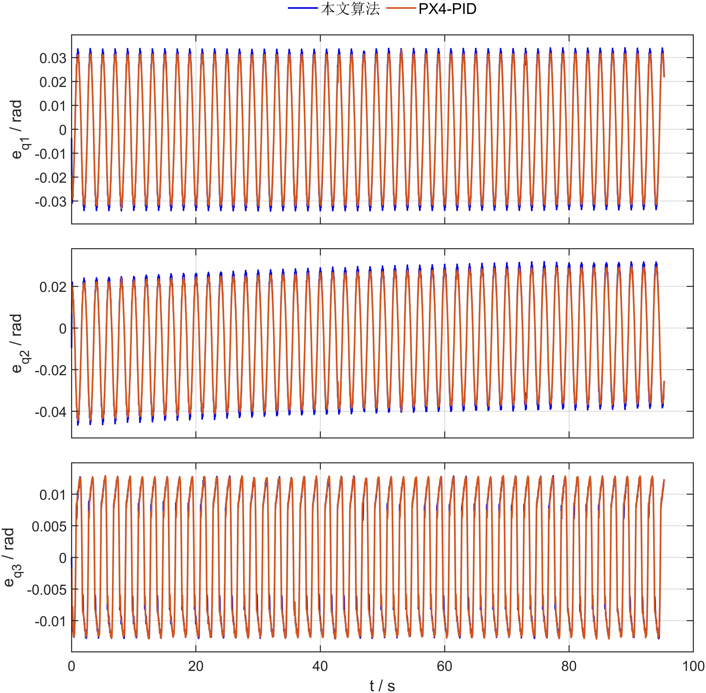

# PX4-SITL Aerial Manipulator ESO Comparison

## 1. Summary

This repository provides a PX4-SITL, Gazebo, and ROS simulation workflow for validating an Extended State Observer (ESO) control stack on the `uam_v5` aerial manipulator. The workflow connects the Gazebo physical model, PX4 low-level controller modules, ROS arm controllers, MAVROS communication, offboard experiment nodes, recorded datasets, and MATLAB plotting scripts.

The current validation focuses on two experiments:

- `exp1_hover_disturbance_uam_v5`: hover disturbance rejection while the manipulator moves periodically.
- `exp4_square_tracking_uam_v5`: square trajectory tracking while the manipulator continues periodic motion.

The comparison is between the paper ESO controller and a PX4-PID baseline. The ESO runs use the PX4 `eso_*` controller modules. The PX4-PID baseline uses the native PX4 multicopter position, attitude, and rate control chain. Both stacks are evaluated on the same `uam_v5` Gazebo model, arm motion profile, ROS experiment nodes, recorded data format, and plotting scripts.

## 2. Project Structure

```text
.
+-- ESO_paper_reproduction/
|   +-- src/setup_px4_sitl_ros_env.sh
|   |   +-- Sets up ROS, PX4-SITL, and Gazebo paths.
|   |
|   +-- src/uav_control/
|   |   +-- launch/arm_pid_SITL_Gazebo_uam_v5.launch
|   |       +-- Shared uam_v5 PX4-SITL + Gazebo + arm-controller bringup.
|   |
|   +-- src/uav_arm_top/
|   |   +-- launch/exp1_hover_disturbance_uam_v5.launch
|   |   |   +-- Exp1 hover disturbance rejection entrypoint.
|   |   +-- launch/exp4_square_tracking_uam_v5.launch
|   |   |   +-- Exp4 square trajectory tracking entrypoint.
|   |   +-- src/eso_hover_disturbance_offboard_node.cpp
|   |   |   +-- Exp1 offboard setpoint publisher and arm-motion trigger.
|   |   +-- src/eso_square_arm_experiment_node.cpp
|   |   |   +-- Exp4 square setpoint publisher and arm-motion trigger.
|   |   +-- scripts/uam_v5_arm_joint_state_bridge.py
|   |       +-- Bridges ROS joint states into PX4 through MAVLink named values.
|   |
|   +-- src/arm_controller/
|   |   +-- launch/controller_bringup_uam_v5.launch
|   |   +-- config/joint_pid_uam_v5.yaml
|   |   +-- scripts/uam_v5_experiment_motion.py
|   |       +-- Gazebo ros_control arm controllers and periodic arm motion.
|   |
|   +-- src/uav_arm_model/
|   |   +-- urdf/uam_v5.urdf.xacro
|   |   +-- meshes/uam_v5/
|   |       +-- ROS robot description, visual meshes, and collision meshes.
|   |
|   +-- data/
|       +-- raw/px4_sitl_comparison_20260513_193944/
|       |   +-- PX4-SITL comparison bags, MATLAB files, metadata, and summary.
|       +-- figure/px4_sitl_comparison_20260513_193944/
|       |   +-- Generated ESO vs PX4-PID comparison figures.
|       +-- scripts/plot_px4_pid_comparison.m
|           +-- Regenerates figures and metric tables from the MATLAB files.
|
+-- Tools/sitl_gazebo/models/uam_v5/uam_v5.sdf
|   +-- Gazebo physical model for the uam_v5 vehicle and manipulator.
|
+-- ROMFS/px4fmu_common/init.d-posix/airframes/10019_uam_v5
|   +-- PX4-SITL airframe that selects the uam_v5 model and starts the control stack.
|
+-- src/modules/
    +-- eso_pos_control/
    +-- eso_att_control/
    +-- eso_rate_control/
    +-- eso_common/
    |   +-- PX4 low-level ESO position, attitude, rate, and shared model modules.
    +-- mc_pos_control/
    +-- mc_att_control/
    +-- mc_rate_control/
        +-- Native PX4 multicopter controllers used by the PX4-PID baseline.
```

The Exp1 and Exp4 information flow is:

1. `roslaunch uav_arm_top ...` starts the experiment entrypoint.
2. The experiment launch includes `uav_control/launch/arm_pid_SITL_Gazebo_uam_v5.launch`.
3. PX4 loads `Tools/sitl_gazebo/models/uam_v5/uam_v5.sdf` through the `10019_uam_v5` airframe.
4. Gazebo and ros_control use `uav_arm_model/urdf/uam_v5.urdf.xacro` and `arm_controller` to drive the manipulator.
5. `uam_v5_arm_joint_state_bridge.py` forwards arm joint states to PX4.
6. PX4 controls the vehicle through either the ESO stack or the PX4-PID baseline.
7. The experiment node publishes offboard setpoints and enables periodic arm motion after the trigger condition is reached.
8. Bags, MATLAB data, summaries, and generated figures are stored under `ESO_paper_reproduction/data/`.

## 3. Workflow and Usage

Prepare the ROS, PX4-SITL, and Gazebo environment:

```bash
cd /home/cf/PX4_Firmware_clean
source /home/cf/PX4_Firmware_clean/ESO_paper_reproduction/src/setup_px4_sitl_ros_env.sh
```

Run Exp1 hover disturbance rejection:

```bash
roslaunch uav_arm_top exp1_hover_disturbance_uam_v5.launch
```

Run Exp4 square trajectory tracking:

```bash
roslaunch uav_arm_top exp4_square_tracking_uam_v5.launch
```

You can also start only the shared `uam_v5` PX4-SITL + Gazebo + arm-controller bringup:

```bash
roslaunch uav_control arm_pid_SITL_Gazebo_uam_v5.launch
```

The current comparison dataset is stored in:

```text
ESO_paper_reproduction/data/raw/px4_sitl_comparison_20260513_193944/
```

The four MATLAB inputs used by the plotting script are:

```text
px4_sitl_mode1_paper_eso.mat
px4_sitl_mode1_px4_pid.mat
px4_sitl_mode2_paper_eso.mat
px4_sitl_mode2_px4_pid.mat
```

Regenerate the comparison figures from the existing `.mat` files:

```matlab
cd('/home/cf/PX4_Firmware_clean')
addpath('ESO_paper_reproduction/data/scripts')

raw_dir = 'ESO_paper_reproduction/data/raw/px4_sitl_comparison_20260513_193944';
figure_dir = 'ESO_paper_reproduction/data/figure/px4_sitl_comparison_20260513_193944';

plot_px4_pid_comparison( ...
    fullfile(raw_dir, 'px4_sitl_mode1_paper_eso.mat'), ...
    fullfile(raw_dir, 'px4_sitl_mode2_paper_eso.mat'), ...
    fullfile(raw_dir, 'px4_sitl_mode1_px4_pid.mat'), ...
    fullfile(raw_dir, 'px4_sitl_mode2_px4_pid.mat'), ...
    figure_dir)
```

The command writes position tracking plots, 3D trajectory and mean-error plots, arm tracking plots, and `px4_pid_metrics_summary.txt` under `figure_dir`.

## 4. Validation Scenarios

The values below come from:

```text
ESO_paper_reproduction/data/figure/px4_sitl_comparison_20260513_193944/px4_pid_comparison/px4_pid_metrics_summary.txt
```

All position metrics are in meters. Arm errors are in radians. `Diverged = 0` means the run did not diverge.

### Exp1: Hover Disturbance Rejection

`exp1_hover_disturbance_uam_v5` validates hover accuracy when periodic manipulator motion injects coupled disturbances. The vehicle enters Offboard mode, tracks a fixed hover setpoint, and then enables arm motion after the altitude and position trigger conditions are satisfied.

Gazebo visualization:



| Controller | Axis mean position error `[x y z]` | 3-axis mean position error | Axis max position error `[x y z]` | Position RMSE | Max position error | Arm axis max error `[q1 q2 q3]` | Diverged |
| --- | --- | ---: | --- | ---: | ---: | --- | ---: |
| Paper ESO | `[0.009243 0.021049 0.019118]` | `0.033942` | `[0.035557 0.084183 0.059154]` | `0.037152` | `0.085860` | `[0.034400 0.048658 0.012865]` | `0` |
| PX4-PID | `[0.007517 0.019445 0.030771]` | `0.040629` | `[0.024049 0.071301 0.085212]` | `0.044450` | `0.087450` | `[0.037056 0.064329 0.012954]` | `0` |

Data files:

```text
ESO_paper_reproduction/data/raw/px4_sitl_comparison_20260513_193944/px4_sitl_mode1_paper_eso.*
ESO_paper_reproduction/data/raw/px4_sitl_comparison_20260513_193944/px4_sitl_mode1_px4_pid.*
```

Figures:




### Exp4: Square Trajectory Tracking

`exp4_square_tracking_uam_v5` validates trajectory tracking accuracy under the same periodic manipulator motion. The scenario adds horizontal square tracking, velocity feed-forward, and corner hold phases, making it a combined test of motion tracking and disturbance rejection.

Gazebo visualization:


| Controller | Axis mean position error `[x y z]` | 3-axis mean position error | Axis max position error `[x y z]` | Position RMSE | Max position error | Arm axis max error `[q1 q2 q3]` | Diverged |
| --- | --- | ---: | --- | ---: | ---: | --- | ---: |
| Paper ESO | `[0.019409 0.021160 0.018729]` | `0.038820` | `[0.082250 0.088785 0.056971]` | `0.041388` | `0.092817` | `[0.034137 0.046554 0.012891]` | `0` |
| PX4-PID | `[0.020426 0.020910 0.018955]` | `0.039301` | `[0.066856 0.085130 0.063215]` | `0.041722` | `0.087831` | `[0.033233 0.044413 0.012906]` | `0` |

Data files:

```text
ESO_paper_reproduction/data/raw/px4_sitl_comparison_20260513_193944/px4_sitl_mode2_paper_eso.*
ESO_paper_reproduction/data/raw/px4_sitl_comparison_20260513_193944/px4_sitl_mode2_px4_pid.*
```

Figures:




Gazebo and PX4-SITL simulate a closed-loop runtime environment with real-time scheduling, sensors, MAVROS communication, Gazebo physics integration, and PX4 controller execution. Even when parameters and launch commands are unchanged, rerun bags, MATLAB files, and metrics can differ at the millimeter level. Figures and tables should therefore be interpreted within the same generated dataset.

The model files are not open-sourced at this time..
